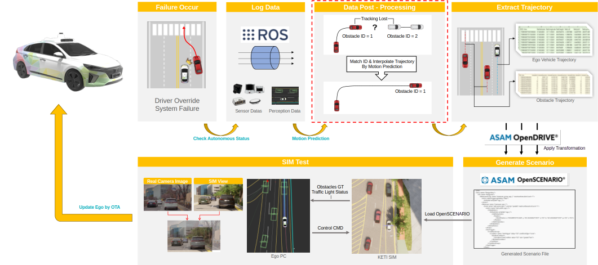
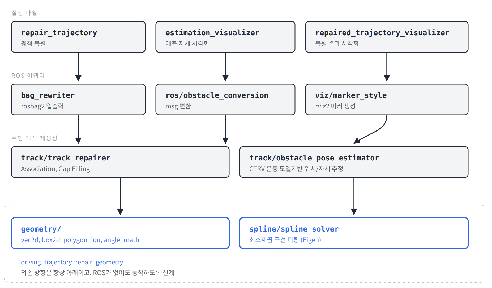

# driving-trajectory-repair

[](LICENSE)
[](http://wiki.ros.org/noetic)
[](https://docs.ros.org)
[](#기하-모듈만-검증하기-의존성-불필요)

> 이 브랜치는 **ROS 1 Noetic** 판입니다. ROS 2 Humble·Jazzy 판은 `main` 브랜치에 있습니다.

자율주행 차량에서 취득된 주행 데이터 중 인지 결과의 **끊어진 도로 이용자(차량, 보행자, 자전거 등) 궤적을 복원**하는 오프라인 SW입니다. 인지 모듈이 타 객체에 가려지거나(occlusion), 미인식/오인식으로 트랙을 놓쳤다가 새로운 ID로 다시 잡은 구간을 재식별하고, 그 사이 빈 구간을 보간해 하나의 연속된 궤적으로 복원하는 전처리 SW 입니다.

> **English** - An offline tool that repairs broken object-tracking trajectories in recorded driving data. When a perception stack loses a track through occlusion and re-acquires it under a fresh id, downstream analysis sees two short trajectories instead of one. This tool re-identifies the pair and fills the gap with spline-interpolated poses, producing a recording that can be replayed as a continuous driving scenario.

### 지원 ROS 버전

**ROS 1과 ROS 2를 모두 지원합니다.** ROS 관례대로 배포판별 브랜치로 나뉘어 있으며, 알고리즘·파라미터 기본값·단위 테스트는 양쪽이 동일합니다.

| 브랜치 | ROS | Ubuntu | C++ | 빌드 |
|---|---|---|---|---|
| **`main`** | **ROS 2 Humble, Jazzy** | 22.04 / 24.04 | 17 | `colcon build` |
| **`noetic-devel`** | **ROS 1 Noetic** | 20.04 | 14 | `catkin_make` |

```bash
git checkout main           # ROS 2 Humble / Jazzy
git checkout noetic-devel   # ROS 1 Noetic
```

Noetic은 2025년 5월에 EOL이 되었지만, 기존 ROS 1을 쓰는 환경을 위해 계속 유지합니다. 새로 시작하는 환경이라면 `main`을 권장합니다.

`geometry`와 `spline`은 ROS 클라이언트 라이브러리를 전혀 include하지 않으므로, 알고리즘 코드 자체는 두 브랜치가 사실상 같습니다.

---

## 목차

- [이 SW를 통해 제공하고자 하는 기능](#이-SW를-통해-제공하고자-하는-기능)
- [아키텍처](#아키텍처)
- [동작 원리](#동작-원리)
- [설치](#설치)
- [사용법](#사용법)
- [파라미터](#파라미터)
- [인터페이스](#인터페이스)
- [인용](#인용)
- [라이선스](#라이선스)
- [사사](#사사)

---

## 이 SW를 통해 제공하고자 하는 기능

자율주행 차량의 인지 모듈은 객체가 다른 차량에 가려지거나 미인식, 오인식되면 추적하던 객체를 잃습니다. 다시 보이는 순간 그 객체는 **새로운 track ID**로 등록됩니다. 이 SW를 통해서 주행 궤적을 재생성하지 않으면 재현 시 아래와 같은 문제가 발생할 수 있습니다.

- 하나의 차량이 여러 개의 짧은 궤적으로 쪼개져 **거동 분석·지표 산출이 왜곡**
- 시뮬레이터로 상황을 재현하면 객체가 **사라졌다가 다른 위치에서 재생성**
- 레이블링 자동화의 입력으로 쓸 때 동일 객체가 **다른 개체로 집계**

아래는 본 SW를 통해서 주행 궤적이 재생성되는 예시이며, 입출력은 같은 포맷으로 주행 데이터를 재생성합니다.


```
입력           트랙 39 ──────╴          ╶────── 트랙 71
                          (가림 구간, 8프레임)

출력           트랙 39 ──────·····················──────
                          (보간된 자세)          ID 통일
```

## 아키텍처



상기 구조에서 복원된 주행 데이터를 시뮬레이터에 재현하는 기술은 별도 저장소인 [driving-scene-replay](https://github.com/Canlab-KADIF/driving-scene-replay)에 있습니다. 

본 SW에서 제공하는 부분은 상기 파이프라인에서 빨간색 dashed 박스에 해당하는 것이며, 로깅된 주행 데이터의 궤적을 복원하는 전처리 SW입니다.




| 빌드 타깃 | 책임 | 외부 의존 |
|---|---|---|
| `driving_trajectory_repair_geometry` | 기하 연산, 운동 모델, 곡선 피팅 | Eigen3 |
| `driving_trajectory_repair_core` | 메시지 변환, 트랙 보정, 로깅파일 입출력 | roscpp, rosbag, 인지 메시지 |
| `driving_trajectory_repair_viz` | 시각화 데이터 생성 | jsk_recognition_msgs, visualization_msgs |

| 실행 파일 | 책임 |
|---|---|
| `repair_trajectory` | 로깅 파일을 읽어 궤적을 복원한 새 로깅 파일 생성 |
| `estimation_visualizer` | 사라진 트랙의 예측 자세를 시각화 |
| `repaired_trajectory_visualizer` | 복원된 주행 궤적 객체를 시각화 |

## 동작 원리

### 1단계: 트랙 상태 추적

로깅 데이터를 프레임 순서대로 읽으며 세 집합을 유지합니다.

- **추적 중**: 현재 프레임에 있는 트랙
- **사라진 트랙**: 직전에 있었으나 이번 프레임에 없는 트랙. 재식별 후보로 `reidentification_window`(기본 2초) 동안만 보관
- **신규 트랙**: 이번 프레임에 처음 나타난 트랙

### 2단계: 사라진 트랙의 현재 자세 추정

사라진 트랙이 "지금이라면 어디 있을지"를 추정합니다. 세 모델을 순서대로 적용합니다.

| 조건 | 모델 | 근거 |
|---|---|---|
| 평균 속력 < 0.83 m/s (3 km/h) | **정지** — 마지막 자세 유지 | 저속에서 인지 heading이 신뢰할 수 없음 |
| 보행자 · 이력 1개 · yaw rate ≈ 0 | **선형** — 속도 적분 | 보행자 heading은 노이즈가 커 회전율로 못 씀 |
| 그 외 | **CTRV** — 등속·등회전율 | 차량의 실제 선회 거동에 부합 |

CTRV 변위:

```
Δx = (v/ω)·[sin(θ + ω·Δt) − sin θ]
Δy = (v/ω)·[−cos(θ + ω·Δt) + cos θ]
```

`v`는 이력 구간 평균 속력, `ω`는 이력 처음↔끝 heading 차이를 시간으로 나눈 값입니다.

### 3단계: 재식별 매칭

신규 트랙과 사라진 트랙의 모든 조합에 대해 **게이팅 후 점수화**합니다.

**게이팅** (하나라도 실패하면 후보 탈락)

- 객체 종류(`type.type`)가 동일할 것
- 추정 박스와 신규 박스가 실제로 겹칠 것 (분리축 정리)
- heading 차이 < `max_heading_error` (기본 π/2)
- 속력 차이 < `max_speed_error` (기본 13.9 m/s = 50 km/h, 도심 데이터 기준 파라미터)

**점수**

```
similarity = IoU
           + 0.5 · cos(Δheading)
           + 0.5 · sqrt(1 − (Δspeed / max_speed_error)²)
```

IoU 가중치가 암묵적으로 1이므로, heading·속력 일치가 겹침 부족을 절반까지만 보상합니다. 점수가 높은 쌍부터 **탐욕적으로** 확정하며, 신규·사라진 트랙 모두 최대 한 번만 매칭됩니다.

### 4단계: 보간

매칭된 쌍의 시작 자세와 끝 자세 사이를 채웁니다.

1. 두 끝점의 heading 차이로 **직선/원호**를 판정하고, 원호면 현 길이와 사잇각으로 반지름과 각속도를 계산
2. 그 등속(원)운동 모델로 중간 프레임마다 **제어점**을 생성
3. 제어점들을 균일 3차 B-스플라인으로 **패널티 최소제곱** 피팅, 중간 제어점은 데이터로 들어가고 계수의 2차·3차 차분에 패널티를 주며, 양 끝점은 실제 관측값이므로 위치와 접선을 KKT 등식제약으로 고정
4. 피팅된 곡선 위의 점을 각 프레임의 보간 자세로 기록

진행 방향이 heading과 150° 이상 어긋나면 후진으로 판정해 접선을 반대로 회전시킵니다. 후진하는 차량을 앞으로 돌려 추종하면서 발생하는 문제인 곡선이 크게 휘는 것을 방지합니다.

### 5단계: 식별자 재부여

`id_matching` 체인을 따라가 재식별된 트랙의 ID를 인지가 처음 부여한 ID로 되돌립니다. 한 트랙이 여러 번 끊겼다 이어질 수 있으므로 체인을 반복 추적하되, 순환이 생겨도 멈추도록 최대 64회로 제한합니다.

## 설치

### 요구사항

| | Noetic |
|---|---|
| Ubuntu | 20.04 |
| C++ | 14 |
| 기본 로깅 저장 형식 | `.bag` |

- CMake ≥ 3.0.2, Eigen3

### 빌드

```bash
git clone https://github.com/Canlab-KADIF/driving-trajectory-repair.git
cd driving-trajectory-repair

# 비공개 메시지 패키지를 src/ 아래에 함께 두어야 합니다
source /opt/ros/noetic/setup.bash
catkin_make
source devel/setup.bash
```

ROS 2 Humble/Jazzy 환경이면 `git checkout main` 후 `colcon build`를 쓰면 됩니다. 기능과 파라미터는 동일합니다.

### 기하 모듈만 검증하기 (의존성 불필요)

`driving_trajectory_repair_geometry`는 ROS 등의 의존성이 전혀 없어, 메시지 패키지 없이도 핵심 알고리즘을 확인할 수 있습니다.

```bash
sudo apt install libgtest-dev libeigen3-dev g++
cd src/driving_trajectory_repair
g++ -std=c++14 -I include -I /usr/include/eigen3 \
    test/test_geometry.cc test/test_obstacle_pose_estimator.cc \
    test/test_spline_solver.cc \
    src/geometry/box2d.cc src/geometry/polygon_iou.cc \
    src/track/obstacle_pose_estimator.cc src/spline/spline_solver.cc \
    -lgtest -lgtest_main -pthread -o test_geometry
./test_geometry      # 34 tests
```

catkin 워크스페이스 안에서는 `catkin_make run_tests_driving_trajectory_repair`로도 실행됩니다. 이 검사는 CI에서 매 PR마다 돌아갑니다.

## 사용법

### 1. 궤적 복원

```bash
# launch 사용 (권장: 파라미터 파일이 함께 적용됨)
roslaunch driving_trajectory_repair repair_trajectory.launch bag:=/path/to/recording.bag

# 직접 실행
rosrun driving_trajectory_repair repair_trajectory /path/to/recording.bag
```

ROS 1 로깅 데이터는 폴더가 아니라 단일 **`.bag` 파일**이므로, 경로에 확장자를 붙여야 합니다.

### 2. 출력 확인

출력 두 개가 생성되며, **원본은 수정되지 않습니다.**

| 파일 | 내용 |
|---|---|
| `recording_repaired.bag` | 원본의 모든 토픽 + 복원된 `/obstacles` |
| `recording_repaired_interpolated_only.bag` | 복원된 자세만 (`/obstacles_modified`) |

복원 대상이 아닌 토픽은 **deserialization 없이 바이트 그대로 복사**되므로, 그 토픽들의 메시지 정의가 없어도 동작

실행이 끝나면 처리 결과가 출력됩니다.

```
예시)
[INFO] repairing /data/recording.bag
[INFO] wrote /data/recording_repaired.bag and /data/recording_repaired_interpolated_only.bag
[INFO] messages: 148203, obstacle frames: 4512, duplicate frames skipped: 37
[INFO] re-identified tracks: 63, interpolated poses: 412
```

### 3. rviz로 확인

```bash
roslaunch driving_trajectory_repair visualize.launch x_offset:=332950.0 y_offset:=4140495.0
rosbag play recording_repaired.bag
```

`x_offset`/`y_offset`은 그려지는 모든 좌표에서 빼는 값입니다. 지도 좌표가 UTM 미터라 rviz의 float32 변환에서 정밀도를 잃기 때문에, 주행 데이터에 들어있는 자차의 좌표 중 한 점을 넣는 것을 권장합니다.

## 파라미터

전부 [`config/driving_trajectory_repair.yaml`](src/driving_trajectory_repair/config/driving_trajectory_repair.yaml)에 있으며 launch 파일이 private 네임스페이스로 올립니다.

### 재식별 게이팅

| 파라미터 | 기본값 | 의미 |
|---|---|---|
| `reidentification_window` | `2.0` s | 사라진 트랙을 후보로 유지하는 시간. 늘리면 매칭이 늘지만 예측이 흐트러진 뒤라 무관한 객체를 잇기 시작함 |
| `max_speed_error` | `13.9` m/s | 동일 객체로 인정하는 속력 차 한계 (50 km/h). 미관측 구간에 가속했을 수 있어 넉넉함 |
| `max_heading_error` | `1.5707963` rad | heading 차 한계 (π/2) |
| `heading_similarity_weight` | `0.5` | 점수에서 heading 항의 가중치 |
| `speed_similarity_weight` | `0.5` | 점수에서 속력 항의 가중치 |

### CTRV 모델

| 파라미터 | 기본값 | 의미 |
|---|---|---|
| `stationary_speed_threshold` | `0.83` m/s | 이 아래는 정지로 보고 자세 유지 (3 km/h) |
| `history_size` | `10` | 트랙당 보관 샘플 수. 클수록 회전율 추정이 매끄럽지만 실제 선회에 늦게 반응 |

### 보간

| 파라미터 | 기본값 | 의미 |
|---|---|---|
| `spline_segment_count` | `8` | 곡선을 이루는 구간 수. 많을수록 제어점을 가깝게 따라가고 덜 매끄러움 |
| `spline_fit_weight` | `1.0` | 적합 항 대 평활 항의 비중. 양 끝점은 등식제약이라 중간 제어점 추종에만 영향 |
| `spline_second_derivative_weight` | `0.2` | 2차 차분 패널티 |
| `spline_third_derivative_weight` | `1.0` | 3차 차분 패널티, 2차의 5배로 둬 곡률이 천천히 변하게 함 |

### 입출력

| 파라미터 | 기본값 | 의미 |
|---|---|---|
| `obstacle_topic` | `/obstacles` | 복원 대상 토픽. 나머지 토픽은 그대로 복사됨 |
| `interpolated_topic` | `/obstacles_modified` | 보간 전용 bag에 쓰는 토픽 |
| `duplicate_frame_tolerance` | `1e-5` s | 이 간격 이내 연속 프레임은 기록기가 중복 기록한 것으로 보고 버림 |

## 인터페이스

### 토픽

| 노드 | 방향 | 토픽 | 타입 |
|---|---|---|---|
| `repair_trajectory` | 기록 읽기 | `/obstacles` | `cyber_perception_msgs/PerceptionObstacles` |
| `repair_trajectory` | 기록 쓰기 | `/obstacles`, `/obstacles_modified` | 〃 |
| `estimation_visualizer` | Subscribe | `obstacles` | 〃 |
| `estimation_visualizer` | Publish | `obstacles_estimation_vis` | `jsk_recognition_msgs/BoundingBoxArray` |
| `estimation_visualizer` | Publish | `obstacles_estimation_vis_vel` | `visualization_msgs/MarkerArray` |
| `repaired_trajectory_visualizer` | Subscribe | `obstacles_modified` | `cyber_perception_msgs/PerceptionObstacles` |
| `repaired_trajectory_visualizer` | Publish | `obstacles_vis_modified` | `jsk_recognition_msgs/BoundingBoxArray` |
| `repaired_trajectory_visualizer` | Publish | `obstacles_vis_vel_modified`, `converter_vis_vel`, `converter_vis_accel` | `visualization_msgs/MarkerArray` |

마커는 `footprint` / `text` / `arrow` 네임스페이스로 나뉘어 있어 rviz에서 따로 켜고 끌 수 있습니다.


### 의존 메시지 명세

인지 결과 메시지는 패키지에 포함하여 배포되지 않습니다. 아래는 이 SW에서 **실제로 읽고 쓰는 필드**로, 아래 메시지를 참고하여 직접 정의하여야 합니다. 복원하고자 하는 도로 이용자의 위치, 자세, 크기, 종류 정보를 정의하여 해당 정보 중 필요한 부분을 반드시 맵핑하여 사용하는 것을 권장합니다.

사용처는 [`src/ros/obstacle_conversion.cc`](src/driving_trajectory_repair/src/ros/obstacle_conversion.cc) 한 곳에 모여 있으므로, 다른 메시지로 교체하려면 그 파일만 수정하면 됩니다.

**예시) **`PerceptionObstacles`**

| 필드 | 타입 | 의미 |
|---|---|---|
| `cyber_header.timestamp_sec` | `float64` | 인지 프레임 시각 (초). **트랙 보정의 시간 기준** |
| `cyber_header.sequence_num` | `uint32` | 프레임 일련번호 (rviz 헤더에만 사용) |
| `perception_obstacle` | `PerceptionObstacle[]` | 이 프레임의 객체 목록 |

**`PerceptionObstacle`**

| 필드 | 타입 | 의미 |
|---|---|---|
| `id` | `int32` | 트랙 ID. 이 도구가 재식별 후 덮어씀 |
| `timestamp` | `float64` | 객체별 시각 (rviz 박스 헤더에만 사용) |
| `position` | `geometry_msgs/Point` | 지도 좌표계 위치 (m). x, y 사용 |
| `theta` | `float64` | heading (rad), +x축 기준 반시계 |
| `velocity` | `geometry_msgs/Point` | 속도 (m/s). x, y 사용 |
| `acceleration` | `geometry_msgs/Point` | 가속도 (m/s²). 시각화에만 사용 |
| `length` | `float64` | 진행 방향 길이 (m) |
| `width` | `float64` | 횡방향 폭 (m) |
| `height` | `float64` | 높이 (m) |
| `type` | `ObstacleType` | 객체 종류. **매칭 시 동일 종류만 후보** |

**`ObstacleType`**

| 필드 | 타입 |
|---|---|
| `type` | `uint8` |

| 값 | 상수 | 이 도구에서의 취급 |
|---|---|---|
| 0 | `UNKNOWN` | 일반 |
| 1 | `UNKNOWN_MOVABLE` | 일반 |
| 2 | `UNKNOWN_UNMOVABLE` | 일반 |
| 3 | `PEDESTRIAN` | **항상 선형 모델** |
| 4 | `BICYCLE` | 일반 |
| 5 | `VEHICLE` | 일반 |

## 인용

```bibtex
@software{keti_driving_trajectory_repair,
  title  = {driving-trajectory-repair: Trajectory repair for recorded autonomous driving data},
  author = {{Korea Electronics Technology Institute}},
  year   = {2026},
  url    = {https://github.com/Canlab-KADIF/driving-trajectory-repair},
  note   = {Developed under IITP grant RS-2023-00232046}
}
```

## 라이선스

[Apache License 2.0](LICENSE). 제3자 고지는 [NOTICE](NOTICE)를 참고하십시오.

## 사사

본 연구는 과학기술정보통신부 및 정보통신기획평가원의 자율주행기술개발혁신사업의 지원을 받아 수행된 연구임 (RS-2023-00232046, 비정상 주행 데이터 전송을 통한 클라우드 기반 원인 분석 기술 개발).

This work was partly supported by Institute of Information & communications Technology Planning & Evaluation (IITP) grant funded by the Korea government(MSIT) (No.2023-00232046, Development of cloud-based cause analysis technology by transmission of abnormal driving data)
